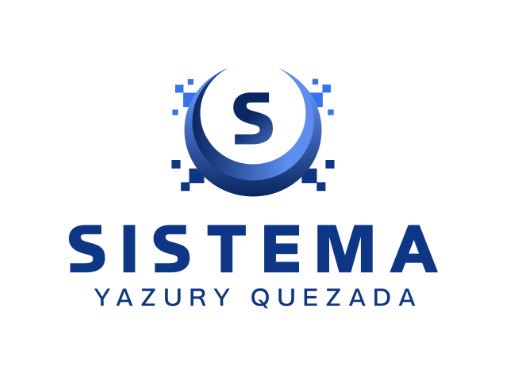
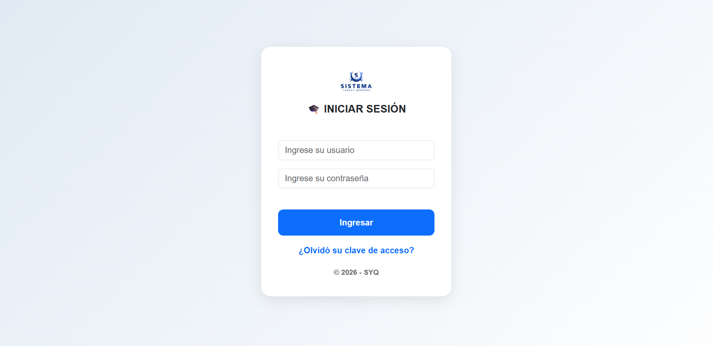
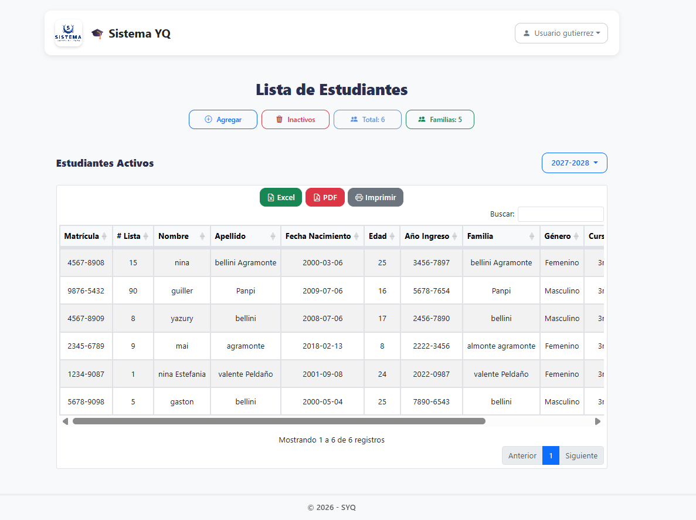
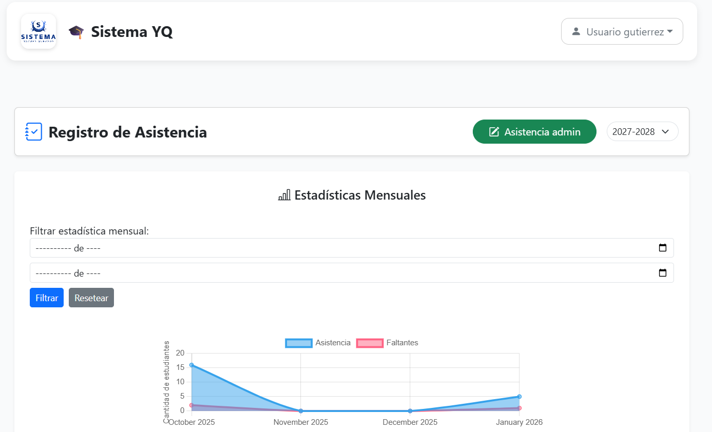

  

<h3 align="center">SYQ • Soluciones Digitales</h3>

Marca digital enfocada en el desarrollo de sistemas web modernos, funcionales y adaptables a las necesidades de empresas e instituciones.

 

<h1 align="center">🏫 Sistema Escolar Digital</h1>

Plataforma web desarrollada para la gestión académica y administrativa de instituciones educativas.

 

  
  
  

 

---

## ✨ Características Principales

- 👨‍🎓 Gestión de estudiantes
- 📚 Gestión de cursos y secciones
- 📝 Registro de notas y asistencia
- 📄 Generación de boletines parciales y finales
- 🧾 Actas de calificaciones
- 📊 Exportación de datos a Excel y PDF
- ⏰ Gestión automática de horarios
- 👥 Sistema de roles (Administrador y Profesor)
- 🔐 Sistema seguro de autenticación y control de acceso
- 🧩 Arquitectura modular organizada
- 📱 Diseño totalmente responsive

---

## 🚀 Beneficios

- Optimiza la administración académica
- Automatiza procesos escolares
- Facilita el control estudiantil
- Reduce procesos manuales
- Mejora la organización institucional
- Permite acceso rápido y seguro a la información

---

## 🛠️ Tecnologías Utilizadas

  
  
  
  
  
  

---

## 🌍 Implementación en Entorno Real

Actualmente este sistema está siendo utilizado en un liceo técnico en artes para la gestión académica y administrativa.

---

## 📸 Funcionalidades del Sistema

### 🔐 Inicio de Sesión

Sistema seguro de autenticación con control de acceso por roles.

---

### 🖥️ Dashboard Principal

Panel administrativo moderno para la gestión general de la plataforma.

---

### 👨‍🎓 Gestión de Estudiantes

Administración de estudiantes, cursos y secciones académicas.

---

### 📋 Control de Asistencia

Registro y seguimiento de asistencia estudiantil de manera organizada y eficiente.

---

### 📱 Diseño Responsive

Interfaz adaptable a computadoras, tablets y dispositivos móviles.

---

## ⚠️ Aviso

El código fuente de este sistema no se encuentra disponible públicamente debido a que la licencia del software se encuentra actualmente en proceso de comercialización y venta.

---

## 📩 Contacto

Si deseas una demostración o adquirir este sistema, puedes contactarme:

📧 **sistemayq@gmail.com**

📱 **+1 (809) 315-9931**

💼 LinkedIn:  
https://www.linkedin.com/in/yazuryquezada

---

✨ Desarrollado por SYQ • Soluciones Digitales

